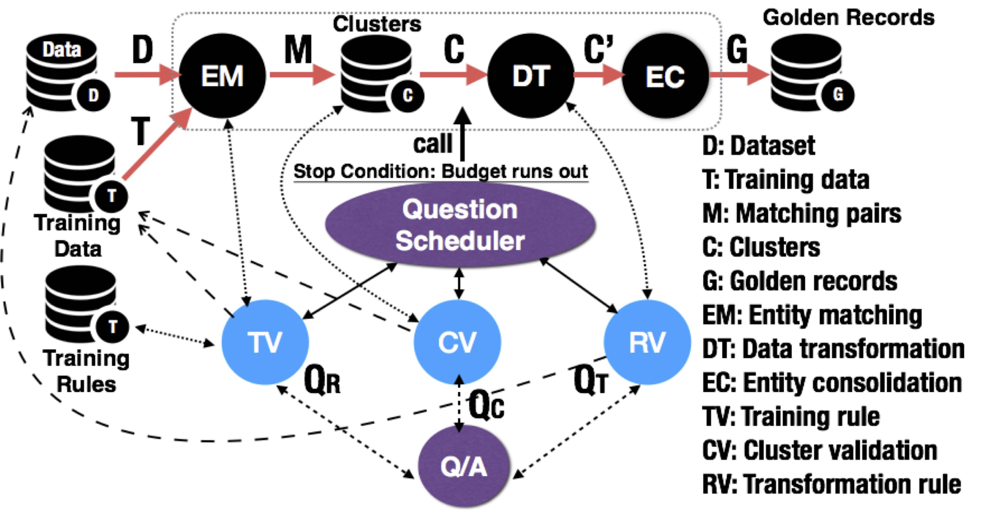
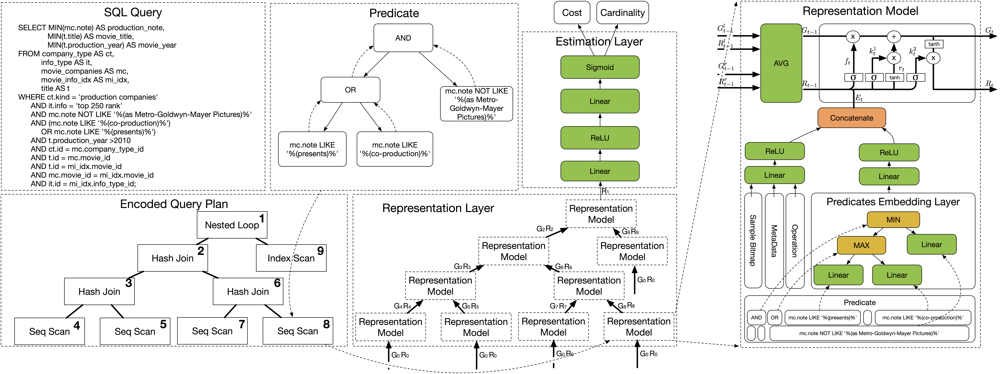
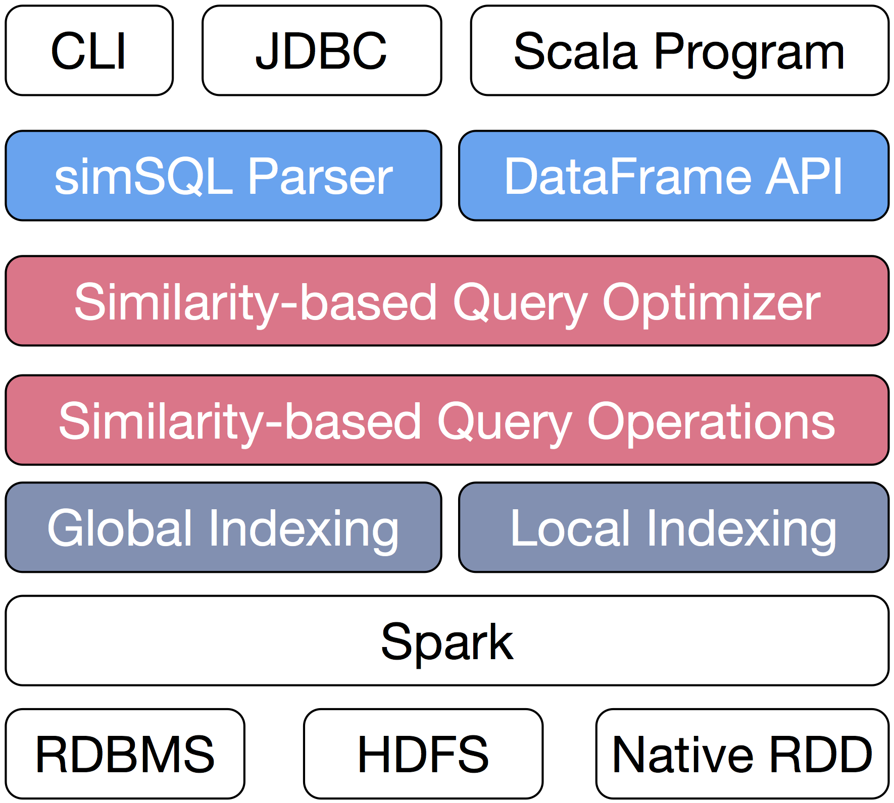

#### I am currently a PhD Candidate in database group of [Tsinghua University](http://www.tsinghua.edu.cn/publish/thu2018en/index.html), under the supervision of professor [Guoliang Li](http://dbgroup.cs.tsinghua.edu.cn/ligl/).I received my bachelor degree in Computer Science of [BUPT](http://www.bupt.edu.cn/). I am interested in Distributed System, Data Integration, Query Optimization, Machine Learning.   
[[Google Scholar](https://scholar.google.com/citations?user=ye4BnicAAAAJ&hl=en)] [[Blog](/blog)]

## Work Experience  
- 2018.08 - 2018.12 Intern at Department of Computing Platform, [Alibaba](https://www.alibabagroup.com/en/global/home),Hangzhou,Zhejiang  

## Ongoing Project
- Optimization with Automatic View Selection.  

## Completed Project
- Optimizing Human Involvement for Entity Matching and Entity Consolidation.  
[Under Review]  
{:height="100px" width="200px"}  

- An End-to-End Learning-based Cost Estimator.  
**Ji Sun**, Guoliang Li  
[[Github](https://github.com/greatji/Learning-based-cost-estimator)] [[Preprint](http://arxiv.org/abs/1906.02560)]  
{:height="100px" width="300px"}  

- Dima: Distributed In-memory Similarity-based Query Processing System.  
**Ji Sun**, Zeyuan Shang, Guoliang Li, Dong Deng, Zhifeng Bao  
[[Github](https://github.com/TsinghuaDatabaseGroup/Dima.git)] [[Demo(VLDB2017)](http://www.vldb.org/pvldb/vol10/p1925-sun.pdf)] [[Full Research(VLDB2019)](http://www.vldb.org/pvldb/vol12/p961-sun.pdf)]  
{:height="100px" width="100px"}  

_____

